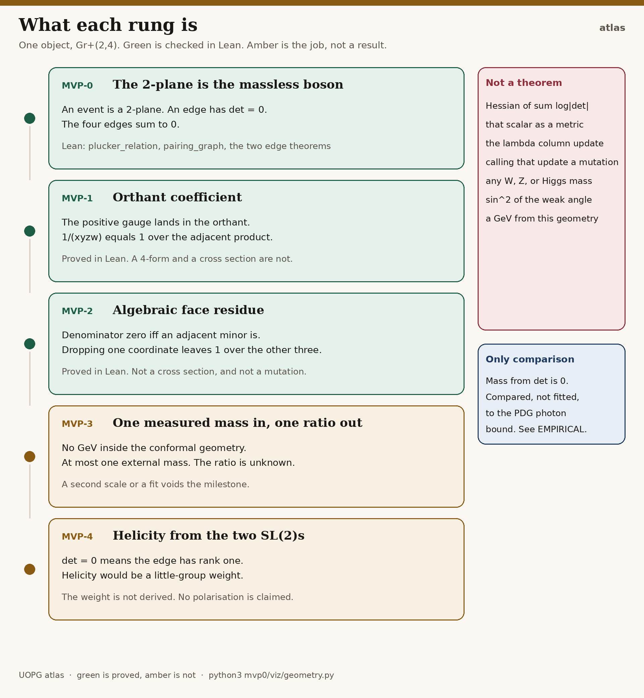
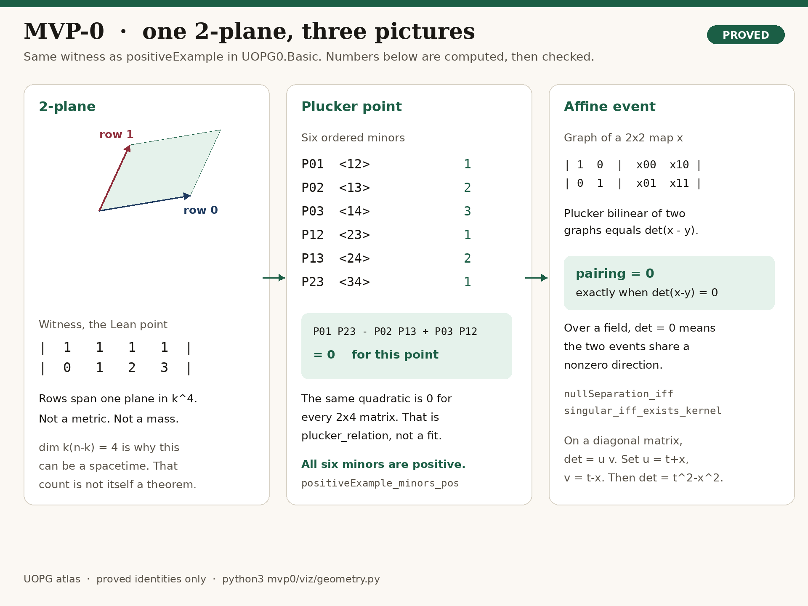
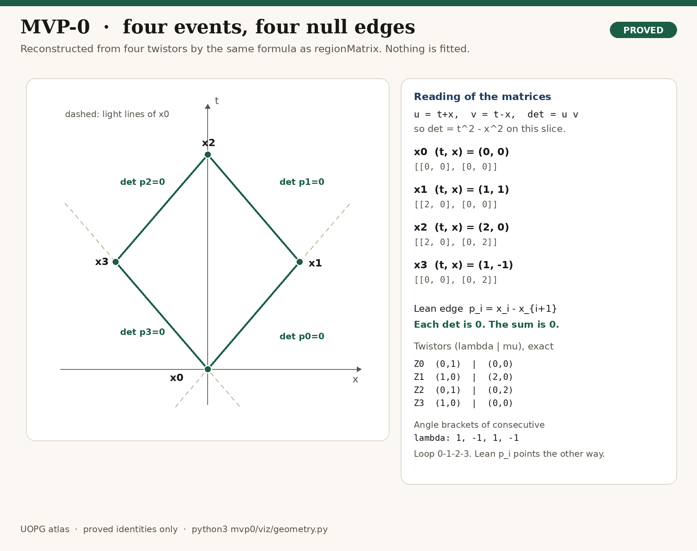
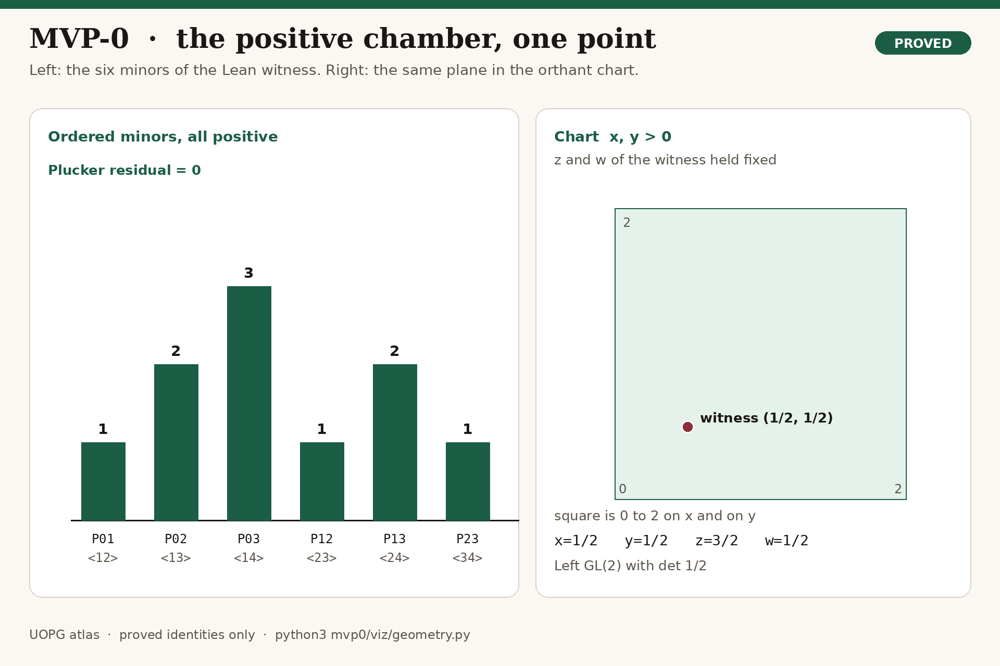
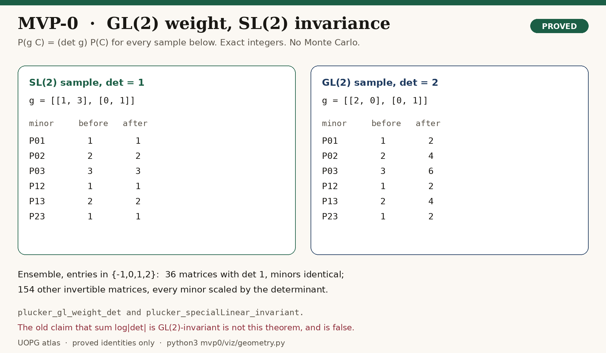
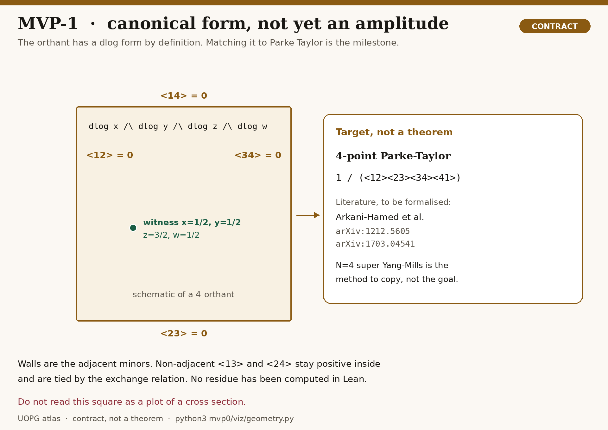
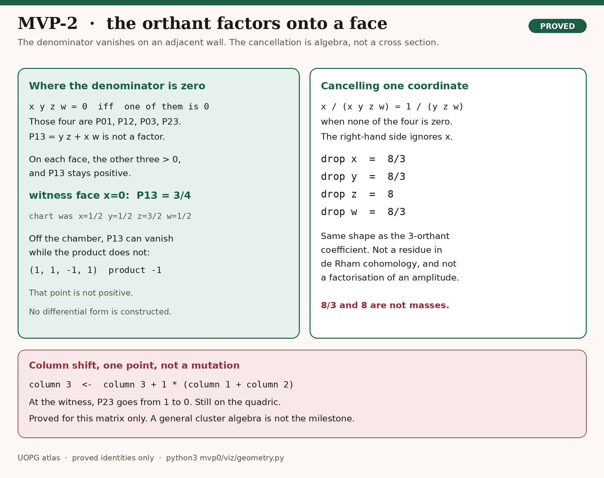
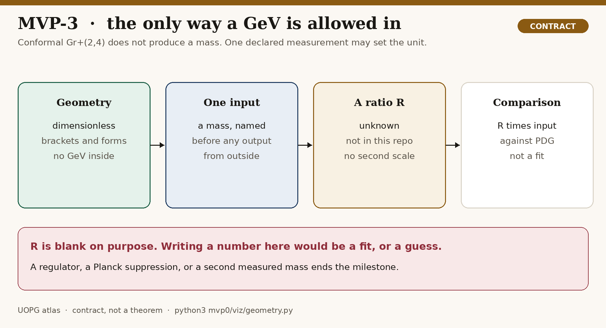
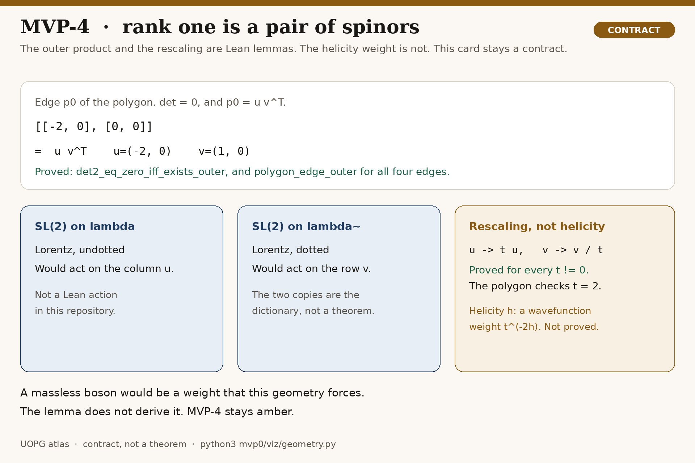

# MVP atlas

One object: the positive Grassmannian `Gr⁺(2,4)`. Spacetime is the Klein correspondence of that object. Particles, if they come out at all, come out of the same field. A rung below is green only when Lean has checked it. An amber rung is the job, not a result.



Regenerate every picture, and recompute the rational numbers on them, with

```bash
python3 mvp0/viz/geometry.py --write   # rewrite docs/figures
python3 mvp0/viz/geometry.py --check   # identities only; fails if shadow.txt is stale
```

The arithmetic is exact (`fractions.Fraction`). There is no Monte Carlo and no fitted scale. `docs/figures/shadow.txt` is the numerical record of the proved identities, including the orthant coefficient `16/3`. If an identity fails, the script does not draw.

The old notebooks simulated a Hessian, a column update, and a calibration to a W mass. Those are not redrawn here. They are not simulations of the proved object.

## MVP-0 — proved

The 2-plane is the massless boson. Theorems and the line they do not cross are in [mvp0/DICTIONARY.md](../mvp0/DICTIONARY.md). The only experiment is [mvp0/EMPIRICAL.md](../mvp0/EMPIRICAL.md): the mass defined by `det` is 0, compared with the PDG photon bound, not fitted to it.









The polygon is not a sketch that was then checked. `regionMatrix` in [mvp0/viz/geometry.py](../mvp0/viz/geometry.py) is the same formula as `UOPG0.regionMatrix`. The four events, the six minors, and the GL(2) ensemble are computed, then the picture is drawn. The light-cone labels `u = t+x`, `v = t−x` are a reading of those diagonal matrices, so that `det = t² − x²`. They are not an extra assumption.

## MVP-1 — proved



When `P02 ≠ 0`, one left `GL(2)` element sends columns 0 and 2 to the identity. On the positive chamber the remaining entries are four positive coordinates `(x, y, z, w)`. Their product is the product of the four ordered adjacent minors. The orthant coefficient is `1/(x y z w)`. The cyclic product uses `⟨4 1⟩ = −P03`, so it is the negative of that product, and the Parke–Taylor coefficient is `1` over the cyclic product.

On the MVP-0 witness the chart is `(1/2, 1/2, 3/2, 1/2)`, the orthant coefficient is `16/3`, and the Parke–Taylor coefficient is `−16/3`. No scale was fitted. The dictionary is [mvp1/DICTIONARY.md](../mvp1/DICTIONARY.md).

What is still not a theorem: a de Rham 4-form, a helicity numerator, a momentum delta, a cross section, and uniqueness of the canonical form for a general positive geometry. N=4 super Yang–Mills is the method that was copied for the rational function, not the target. The literature for the form that this coefficient is the rational part of is Arkani-Hamed–Bourjaily–Cachazo–Goncharov–Postnikov–Trnka (arXiv:1212.5605) and Arkani-Hamed–Bai–Lam (arXiv:1703.04541).

## MVP-2 — proved



The denominator `x y z w` is zero exactly when one ordered adjacent minor of the chart is zero. Those minors are `P01`, `P12`, `P03`, and `P23`. The non-adjacent minor `P13 = y z + x w` is not a factor. On each codimension-1 face, where one coordinate is zero and the other three stay positive, `P13` stays positive. Off the chamber, `P13` can vanish while the product does not: at `(1, 1, -1, 1)` the product is `-1`.

If none of the four is zero, `x / (x y z w) = 1 / (y z w)`, and the same for `y`, `z`, and `w`. The right-hand side does not depend on the cancelled coordinate. On the witness, dropping `x`, `y`, or `w` gives `8/3`, and dropping `z` gives `8`. That is the orthant factoring onto a face. It is not a de Rham residue and not a cross section.

The column update from the 2026 drafts is a different map. At the witness and `λ = 1` it sends `P23` from 1 to 0, and the matrix stays on the quadric because every 2-plane does. That one point is a theorem. A general cluster algebra is not. The dictionary is [mvp2/DICTIONARY.md](../mvp2/DICTIONARY.md).

## MVP-3 — contract



`Gr⁺(2,4)` is conformal. It does not contain a GeV. The only contract that can produce a mass is: one measured mass, declared before the comparison, and a dimensionless ratio R that a proof computes with no remaining freedom. R is not in this repository. A regulator, a Planck suppression, or a second measured mass ends the milestone. Nothing on this page is a prediction of an electroweak mass.

## MVP-4 — contract



`det p = 0` is proved, and so is the existence of a kernel vector. Rank at most one means the matrix is an outer product `u vᵀ`; the script exhibits that factor for the four edges and checks that `u → t u`, `v → v/t` leaves `p` fixed. That rescaling is ordinary linear algebra on a proved null matrix. It is not yet a Lean theorem, and it is not a helicity. A massless boson would be a weight the geometry forces. MVP-4 has to derive the weight. It does not become a gluon, a W, a Z, or a fermion by being the last rung on this ladder.

## What is not in the atlas

- a Hessian of `Σ log|det|`, or that scalar as a metric
- the λ column update, promoted to a mutation
- a W, Z, or Higgs mass, or `sin²θ_W`
- a gluon, a W, a Z, or a fermion, read off from `Gr⁺(2,4)`
- a GeV produced by the geometry
- a cross section, a wave equation, or a Monte Carlo calibration

`Gr⁺(2,4)` is one massless 4-point positive geometry. Distinguishing Standard Model bosons, or adding a fermion, would be a new rung. None of that is implied by MVP-4, and none of it is scheduled.
